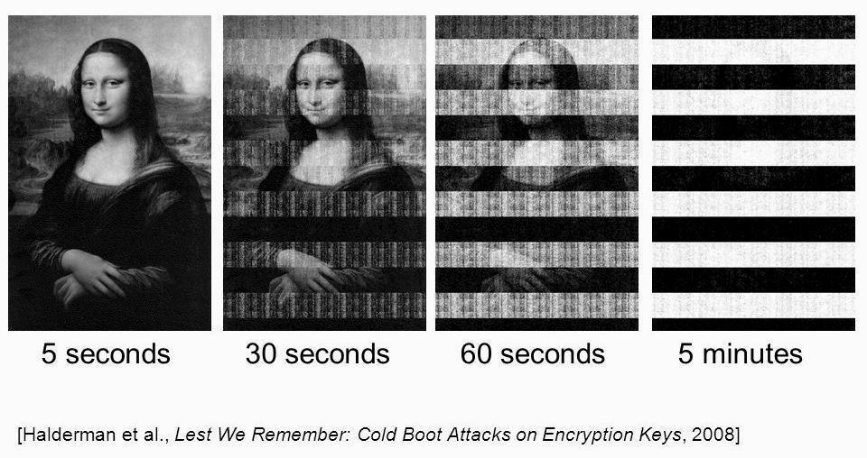
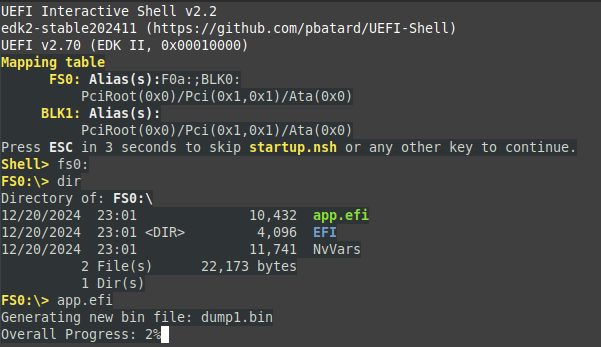
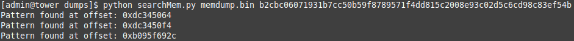
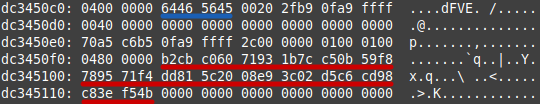
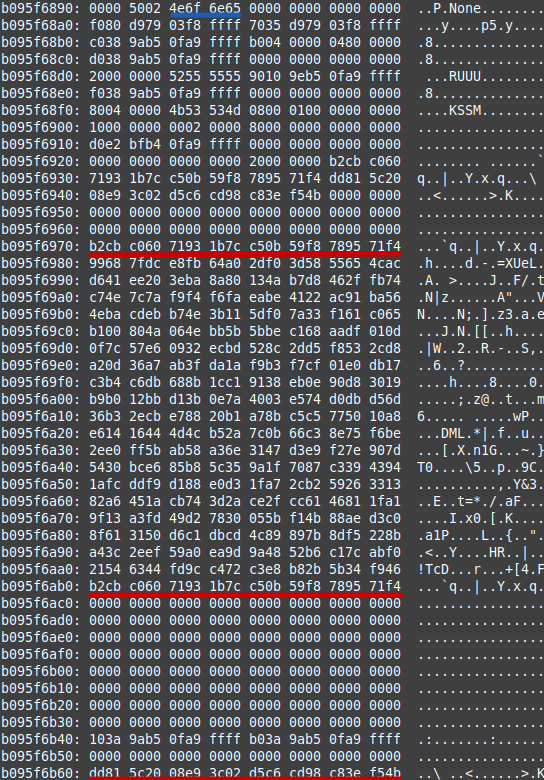

## Intro

In this article I will demonstrate how to bypass BitLocker encryption on Windows 11 (version 24H2).
This was accomplished by extracting full volume encryption keys (FVEK) from memory using my tool Memory-Dump-UEFI. 

## Background

If an attacker has physical access to the device, they can potentially get access by 
apruptly restarting the computer and dumping RAM from recently running instances of Windows. The captured
memory can be analyzed to locate sensitive information like FVEK keys.
This technique is not foolproof as the contents of RAM will rapidly degrade when power is cut off. 

	

There are several techniques to mitigate this memory degradation, including cooling the RAM physically or using
external power sources to maintain power delivery. In the case of this demo, I shorted the reset pins on the device's
motherboard, which causes the system to abruptly restart without losing power. 

Another potential issue is secure boot, which is a security standard that restricts what is allowed to run when
a device starts up. This protection has its own limitations, and has been bypassed using shims or a variety 
of other means that are outside the scope of this demo. 

## Step 1: Create a Bootable USB Device

For this step you must obtain a USB storage device that is larger than however much RAM is on
the target system. I have included a script called `flashimage.sh` to simplify this step.

[Follow the steps detailed here to create and use the bootable application.](https://github.com/NoInitRD/MemoryDumpUEFI)

## Step 2: Abruptly Restart the Target System

This can be done in a variety of ways but the goal is to minimize how much time the computer is completely powered off.
In my experience I have had the most success restarting the system while Windows is loading but before the login
screen has appeared, at least in the case of finding FVEK keys. 

## Step 3: Boot from the USB Device 

Immediately boot to Memory-Dump-UEFI from the USB device. You will arrive at the UEFI shell, where you can locate
and execute `app.efi`. There are more details on how to do this in the [README](https://github.com/NoInitRD/Memory-Dump-UEFI/blob/d04feef409313f2ec3d314cb4d642e2ee0da9930/README.md)
for the application. The amount of time it will take depends on the amount of RAM being dumped and the speed of
the USB device. I recommend leaving any other USB storage devices unplugged during this step to avoid the 
program accidentally writing to the wrong drive. 

	

Above is an example of what it should look like when you make it to the shell. The memory dump will start generating
dump files until it runs out of memory. After its completed, feel free to shut the computer off like normal. 

## Step 4: Analyzing the Dumps

### Setup

There will probably be several dumps produced by the application. This is due to the 4GB limit on file size
imposed by the FAT32 filesystem. The filesystem has to be FAT32 meet UEFI specification. For 
convenience purposes I have included a script in the tools directory called `concatDumps.py` 
that can combine several dumps into one in chronological order. The content of the dump will consist 
of whatever raw data was inside memory at the time, so I recommend a tool like `xxd` to read it more easily.
To help with searching the dumps I included a script called `searchMem.py` that allows you to search for a
hex pattern within the dump. It will find the offset of instances of that hex pattern, which you can then jump
to by using `xxd -s <offset> <dump>`.

	

 

### Pool Tags

Pool tags are 4 character long identifiers that indicate where Windows kernel memory pools are. These pools 
are allocated by the Windows kernel and are great places to look for sensitive information. There are a large
number of these pool tags, and I included a text file called `pooltag.txt` which contains a list
of the pool tags with details about their respective purposes. 

Before continuing I'd like to give Microsoft a round of applause for being kind enough to plainly mark where
cryptographic keys show up in memory.
Back on Windows 7, key recovery was as simple as locating the `FVEc` pool tag, which corresponds to cryptographic
allocations under `fvevol.sys`. On Windows 8.1 and 10 the key could be found in the memory pool tagged by 
`Cngb` which corresponds to the `ksecdd.sys` module. Throughout my study of the Windows 11 memory dump, I couldn't
locate the key in either of those places, but I did find it in two other locations.

### FVEK Key Recovery

The first place I located the FVEK key was under the `dFVE` pool tag, which indicates memory allocated by 
`dumpfve.sys`, which pertains to the full volume encryption crash dump filter for bitlocker drive encryption.
The pool tag is underlined in blue while the FVEK key is highlighted in red. This was the easiest and most 
consistent location I found the key, and it is also prefaced by `0x0480` which indicates the type of encryption
being used, which in my case is XTS-AES-128.

	

The second location is under the `None` tag, which pertains to calls to the `ExAllocatePool` routine. This time
the first half of the key can be seen two times and the second half once. 

	

### Next Steps

It's important to note that you need to preface 
whatever key you obtain with what algorithm is being used. That means if your key is:

`b2cbc06071931b7cc50b59f8789571f4dd815c2008e93c02d5c6cd98c83ef54b`

You need to add `0x8004` (or whatever the algorithm used was) to the beginning of the key in little endian format
like this:

`0480b2cbc06071931b7cc50b59f8789571f4dd815c2008e93c02d5c6cd98c83ef54b`

Next, you need to take that hex and dump it into a file, which can be done like:

`echo "0480b2cbc06071931b7cc50b59f8789571f4dd815c2008e93c02d5c6cd98c83ef54b" | xxd -r -p > output.fvek`

I highly recommend using the `dislocker` suite of tools to figure out which algorithm/value you
need and to ultimately unlock the drive. If you did everything correctly you can use `output.fvek` to unlock
the bitlocker protected partition and access any data on the volume.

## Final Notes

The best possible way to understand how Microsoft implemented bitlocker is to do kernel level debugging using
`windbg`. This can be done fairly easily using virtual machines or a crossed over USB 3.0 A/A cable. The reason I was
able to find the key in the first place is by stepping through the Windows boot process and watching bitlocker
in action. Microsoft makes an effort to destroy keys using functions like `SymCryptSessionDestroy` but they 
fail to destroy every key, as evident by its presence on the heap. 

## References

<https://tribalchicken.net/recovering-bitlocker-keys-on-windows-8-1-and-10/>

<https://github.com/libyal/libbde/blob/main/documentation/BitLocker%20Drive%20Encryption%20(BDE)%20format.asciidoc>

<https://github.com/Aorimn/dislocker>

<https://github.com/microsoft/SymCrypt>

<https://github.com/libyal/libbde>

<https://github.com/zodiacon/PoolMonX/blob/master/res/pooltag.txt>

<https://techcommunity.microsoft.com/blog/askperf/an-introduction-to-pool-tags/372983>
